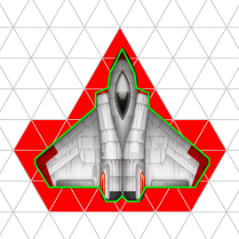
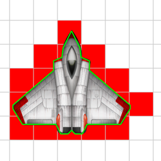
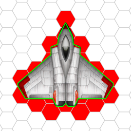

# RSContactGrid

## Example project

You can play with the example project and different grid element types by just switching the typealias for `ElementType` in `GameScene.swift`.

E.g. if you want to play with a triangular grid, just change line 24 in `GameScene.swift` to:

	typealias ElementType = TriangularElementType

## Documentation

`RSContactGrid` is programmed in the *protocol orientated* way introduced in Swift 2.0. That means you can easily switch the implementations by just confirming to the protocols `GridType` and `GridElementType`. These two protocols come with a bunch of default implementations that don't need to be implemented twice.

### GridType

	protocol GridType { ... }
	
#### Inheritance

* `Hashable`
* `Equatable`
* `SequenceType`
* `ArrayLiteralConvertible`
* `CustomStringConvertible`
* `CustomDebugStringConvertible`

#### Associated types
    
	typealias ElementType: GridElementType
    
#### Initializers

	init()
Create an empty `GridType`.

    init(minimumCapacity: Int)
Create an empty `GridType` with at least the given number of elements worth of storage.  The actual capacity will be the smallest power of 2 that's >= `minimumCapacity`.
    
    init<S : SequenceType where S.Generator.Element == ElementType>(_ sequence: S)
Create a `GridType` from a finite sequence of elements.
	
#### Instance variables
    
    var count: Int { get }
Returns the number of elements.
    
    var delegate: GridDelegate? { get set }
 A delegate that is called when a polygon is added into the grid and possibly overlays elements.
    
#### Instance methods
    
    mutating func insert(element: ElementType)
Insert a element into the grid.
	
    mutating func remove(element: ElementType) -> ElementType?
Remove the element from the grid and return it if it was present.
    
    mutating func removeAll(keepCapacity keepCapacity: Bool)
Erase all elements.  If `keepCapacity` is `true`, `capacity` will not decrease.
    
#### Subscripts
    
    subscript(x: Int, y: Int) -> ElementType? { get }
Returns the element of a given position, or `nil` if the position is not present in the grid.

#### Default implementations

	var isEmpty: Bool { get }
`true` if the grid is empty.
    
    mutating func insertAtX(x: Int, y: Int)
Insert an initial element at position `x`, `y` into the grid.
    
    mutating func removeAtX(x: Int, y: Int) -> ElementType
Remove the element at position `x`, `y` from the grid and return it if it was present.
	
	init(arrayLiteral elements: ElementType...)
Create an instance initialized with elements.
	
	var description: String { get }
A textual representation of `self`.
	
	var debugDescription: String { get }
A textual representation of `self`, suitable for debugging.
		
	mutating func addPolygon(var polygon: [CGPoint], allowInsertingElements: Bool = true, @noescape resolveContact: ElementType -> ElementType)
Adds a virtual polygon into the grid and defines behavior for overlayed elements.
* Parameter `polygon`: The vertices of the polygon as a finite sequence of `CGPoint`.
* Parameter `allowInsertingElements`: Allows the grid to insert element, which are overlayed by the polygon, but are not yet inserted into the grid.
* Parameter `resolveContact`: Returns the new behavior of a `ElementType` that is overlayed by the polygon.

## Delegation

## Writing your own grid element types

You can easily write your own grid element type by conforming to the `GridElementType` protocol. That means you have to implement:

* `var x: Int { get }`
* `var y: Int { get }`
* `init(x: Int, y: Int)`
* `var vertices: [CGPoint] { get }`
* a more efficient version of `var frame: CGRect { get }` (optional)
* `func intersectsRelativeLineSegment(point1 point1: RelativeRectPoint, point2: RelativeRectPoint) -> Bool`
* `static func elementsInRect(rect: CGRect) -> Set<Self>`
* `==` and `<` operands for adopting to the `Comparable` protocol

You can look up the existing element types (`TriangularElement`, `SquareElement`, `RotatedSquareElement` and `HexagonalElement`) to give you a hint on how to conform to `GridElementType`.

## Additional information

`RSContactGrid` was developed and implemented for the use in *Dig Deeper - the Mining / Crafting / Trading game*. *Dig Depper* is currently in developement and has its own *GitHub* project [here](../../../DigDeeper).

## License

Copyright (c) 2015 Matthias Fey <matthias.fey@tu-dortmund.de>

Permission is hereby granted, free of charge, to any person obtaining a copy of this software and associated documentation files (the "Software"), to deal in the Software without restriction, including without limitation the rights to use, copy, modify, merge, publish, distribute, sublicense, and/or sell copies of the Software, and to permit persons to whom the Software is furnished to do so, subject to the following conditions:

The above copyright notice and this permission notice shall be included in all copies or substantial portions of the Software.

THE SOFTWARE IS PROVIDED "AS IS", WITHOUT WARRANTY OF ANY KIND, EXPRESS OR IMPLIED, INCLUDING BUT NOT LIMITED TO THE WARRANTIES OF MERCHANTABILITY, FITNESS FOR A PARTICULAR PURPOSE AND NONINFRINGEMENT. IN NO EVENT SHALL THE AUTHORS OR COPYRIGHT HOLDERS BE LIABLE FOR ANY CLAIM, DAMAGES OR OTHER LIABILITY, WHETHER IN AN ACTION OF CONTRACT, TORT OR OTHERWISE, ARISING FROM, OUT OF OR IN CONNECTION WITH THE SOFTWARE OR THE USE OR OTHER DEALINGS IN THE SOFTWARE.